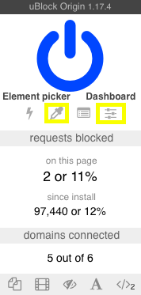

# FixTheWeb

FixTheWeb blocks the annoying parts of websites overlooked by ad blockers and popup blockers. 

## To Install

1. Install uBlock Origin for [Chrome](https://chrome.google.com/webstore/detail/ublock-origin/cjpalhdlnbpafiamejdnhcphjbkeiagm), [Firefox](https://addons.mozilla.org/en-US/firefox/addon/ublock-origin/) or [Safari](https://safari-extensions.apple.com/details/?id=com.el1t.uBlock-3NU33NW2M3). 

2. Navigate to the uBlock Origin dashboard by clicking the uBlock icon and selecting the settings button on the right. (See the image below for reference).

3. Select the 'My filters' tab. 

4. Download [FixTheWeb.txt](https://raw.githubusercontent.com/nickslevine/FixTheWeb/master/FixTheWeb.txt) or copy its contents. 

5. Add FixTheWeb.txt to your uBlock filters in the 'My filters' tab by pasting the contents into the box or clicking "Import and append" and selecting the FixTheWeb.txt file. 

## To Customize

### Removing Filters

If FixTheWeb breaks a website or removes functionality from a website that you want, simply navigate to the uBlock Origin 'My filters' tab and remove the relevant lines from the filters document, and click 'Apply changes'. 

### Adding Filters

To add a filter - and thereby block an annoying piece of content from appearing on a website - click the UBlock Origin icon, select element picker mode (the eyedropper button), click on the piece of content you'd like to block, and click 'create' when the dialog box appears. See the image above for the location of the element picker tool.  

## To Contribute

FixTheWeb is a work in progress. Please suggest additions by submitting a pull request or [opening an issue](https://github.com/nickslevine/FixTheWeb/issues). 

